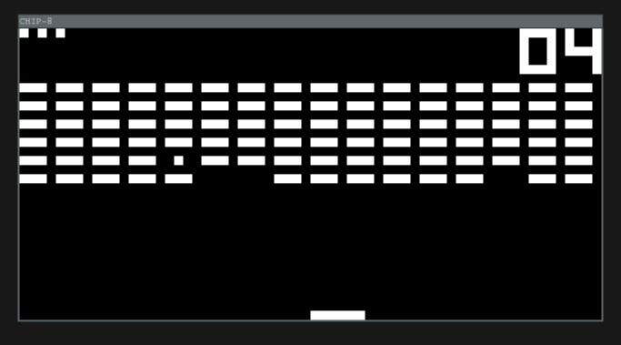
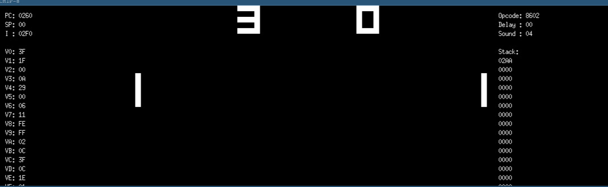

# CHIP-8
A Chip-8 emulator in go

## About CHIP-8

CHIP-8 is a simple interpreted programming language and virtual machine originally developed in the 1970s by Joseph Weisbecker. It was designed to make game programming easier on early computers and later became one of the most popular beginner projects in emulator development.

## About This Project

I built this emulator primarily for learning purposes. The goal of this project was to understand how emulators work internally.

## Features

* [x] CHIP-8 CPU implementation
* [x] Opcode decoding and execution
* [x] 4 KB memory system
* [x] 16 general-purpose registers
* [x] Stack and subroutine support
* [ ] Delay and sound timers
* [x] 64×32 monochrome display
* [x] Sprite drawing
* [x] ROM loading
* [x] Keyboard input
* [ ] Debugger
* [ ] Save states
* [ ] Disassembler
* [ ] Super-CHIP support
* [ ] Configurable key mappings

## Resources

Useful references while building a CHIP-8 emulator:

* [Cowgod's CHIP-8 Technical Reference](http://devernay.free.fr/hacks/chip8/C8TECH10.HTM)
* [Tobias V. Langhoff's CHIP-8 Guide](https://tobiasvl.github.io/blog/write-a-chip-8-emulator/)
* [CHIP-8 Archive](https://johnearnest.github.io/chip8Archive/)
